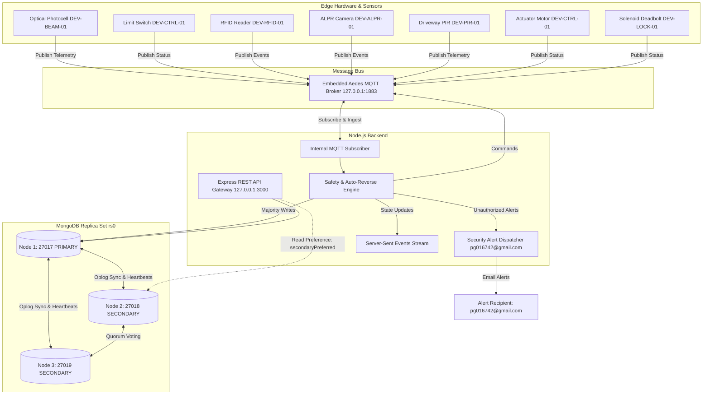
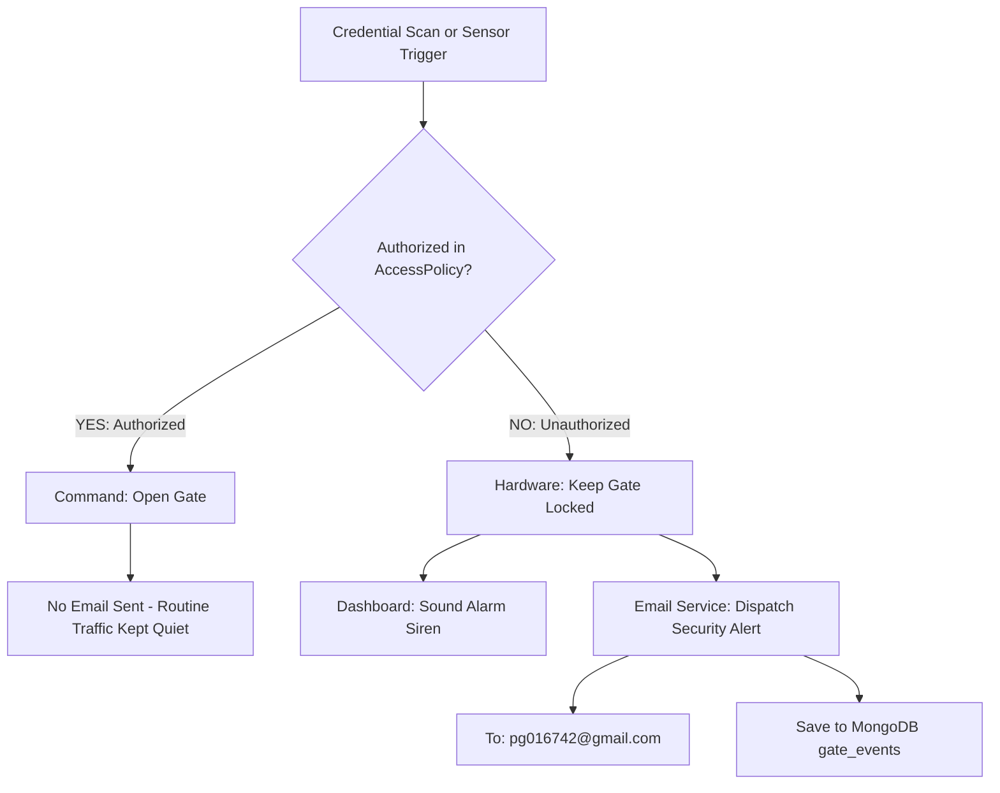

# IoThings Smart House Main Gate Automation System
### CMP6207 Modern Data Stores — Coursework Implementation & Technical Report

---

## Table of Contents

1. [Project Overview](#project-overview)
2. [Key Features](#key-features)
3. [System Architecture](#system-architecture)
4. [Quickstart Guide](#quickstart-guide)
5. [Viva Demonstration Guide](#viva-demonstration-guide)
6. [MQTT Broker Setup & Verification](#mqtt-broker-setup--verification)
7. [Core Sensor Dynamics & Limit Switch States](#core-sensor-dynamics--limit-switch-states)
8. [Telemetry Cadence & Retention](#telemetry-cadence--retention)
9. [Security Alert Email Notifications](#security-alert-email-notifications)
10. [API Testing & Monitoring](#api-testing--monitoring)
11. [Benchmark Evaluation](#benchmark-evaluation)
12. [REST API & MQTT Reference](#rest-api--mqtt-reference)
13. [Project Structure](#project-structure)
14. [Local Deployment Details](#local-deployment-details)
15. [Troubleshooting & FAQs](#troubleshooting--faqs)
16. [Assessment Brief Compliance Matrix](#assessment-brief-compliance-matrix)
17. [Coursework Deliverables](#coursework-deliverables)

---

## Project Overview

This project implements an IoT modern data store and automated access control backend for **IoThings Home Automation Solutions** (a UK SME specializing in residential smart security).

The application controls the main gate of a smart house using a distributed **MongoDB 3-node replica set (`rs0`)**, an embedded **Aedes MQTT broker** (`port 1883`), and an **Express REST API** (`port 3000`). It was built for the Birmingham City University Level 6 module **CMP6207: Modern Data Stores**.

---

## Key Features

- **Distributed MongoDB Replica Set (`rs0`):** Three local nodes on ports 27017 (Primary), 27018 (Secondary), and 27019 (Secondary) with majority write concern (`{ w: "majority", j: true }`) and automatic election failover.
- **Three Core Sensor Suites:**
  - **Optical Safety Photocell:** Signal strength (0–100%), beam continuity, and preventative dirty-lens warnings.
  - **Mechanical Limit Switch (Dual-Boundary):** Seating verification across `FULLY_CLOSED` (~2.1W idle), `FULLY_OPEN` (~2.3W idle), and `AJAR` transit (~48W active draw).
  - **Contactless RFID Reader:** Heartbeat status, antenna tuning, and RF noise floor monitoring.
- **Safety Auto-Reverse (<8ms):** Immediately halts and opens the gate if an obstruction breaks the photocell beam while closing.
- **15-Second Telemetry Stream:** Emits real-time operational states across MQTT and stores them in MongoDB with a 30-day TTL expiration index.
- **Targeted Security Alerts:** Dispatches security alert emails to `pg016742@gmail.com` exclusively when an unauthorized entry attempt occurs (unregistered RFID, unrecognized plate, perimeter intruder). Routine authorized access is kept quiet to prevent inbox clutter.
- **Interactive Web Dashboard:** Glassmorphic UI with animated SVG gate leaves, live sensor telemetry gauges, access policy management, and an audible alarm siren with silence controls.
- **Automated Test Harness:** 18 integration tests covering API endpoints, database failover, CRUD policies, and alert pipelines (100% passing).
- **Postman Test Suite:** 36 pre-configured requests across 6 folders covering all routes with automated assertions.

---

## System Architecture



---

## Quickstart Guide

### 1. Prerequisites
- **Node.js**: v18 or newer
- **MongoDB**: Community edition installed locally (`mongod` available in PATH)

### 2. Start the MongoDB 3-Node Replica Set
```bash
npm run cluster:start
```
Launches three background `mongod` instances on ports `27017`, `27018`, and `27019`, then initializes replica set `rs0`.

### 3. Seed Sample Data
```bash
npm run seed
```
Inserts initial synthetic data into MongoDB:
- 1,850+ gate events
- 4,030+ historical telemetry records
- 7 hardware device profiles
- 6 access policies

### 4. Start the Application Server
```bash
npm start
```
Starts the Express REST API on `http://localhost:3000` and the embedded Aedes MQTT broker on port `1883`. The 15-second telemetry emitter starts automatically.

To stop the server:
```bash
npm run server:stop
```

### 5. Run the Automated Tests
```bash
npm test
```
Executes all 18 integration tests against the live API and replica set.

### 6. Test Security Email Alerts
```bash
# Simulate an unauthorized intruder (records audit event, keeps gate locked, dispatches alert)
npm run sim:unauthorized

# Or test direct email delivery:
npm run test:email
```

### 7. Run the Benchmark Harness
```bash
npm run benchmark
```
Measures CRUD latencies, write concern overhead (`w: 1` vs `w: majority`), and aggregation performance, outputting results to [`report/benchmark_results.json`](file:///Users/pramod/Desktop/Modern_data_stores/report/benchmark_results.json).

### 8. Generate the Coursework Report PDF
```bash
npm run report:pdf
```
Renders the HTML coursework report into [`report/IoThings_Main_Gate_Automation_Report.pdf`](file:///Users/pramod/Desktop/Modern_data_stores/report/IoThings_Main_Gate_Automation_Report.pdf) matching BCU submission guidelines.

---

## Viva Demonstration Guide

A recommended sequence for presenting the system during an examination or viva:

| Step | Action / Command | Explanation | Expected Result |
| :--- | :--- | :--- | :--- |
| **1. Cluster Start** | `npm run cluster:start` | Explain 3-node replica set architecture, quorum voting, and consensus. | Terminal reports nodes 27017, 27018, and 27019 joined in `rs0`. |
| **2. Data Seeding** | `npm run seed` | Discuss synthetic GDPR-compliant dataset and data models. | Confirms insertion of events, telemetry, hardware, and access policies. |
| **3. Server Launch** | `npm start` | Explain unified Express REST API and embedded MQTT broker. | Logs show connection to `rs0`, MQTT on 1883, and HTTP on 3000. |
| **4. Web Dashboard** | Open `http://localhost:3000` | Walk through SVG gate visualizer, live gauges, and policy manager. | Displays green status badges for MongoDB, MQTT, and server health. |
| **5. Gate Actuation** | Click **Open Gate** in UI | Trace event pipeline: HTTP POST -> MQTT command published -> gate opens. | UI animates gate opening; server terminal logs the request. |
| **6. Safety Auto-Reverse** | Click **Simulate Beam Interruption** | Demonstrate safety reverse (<8ms) when photocell is tripped while closing. | Gate immediately reverses to OPEN to prevent vehicle pinch. |
| **7. Security Alert** | `npm run sim:unauthorized` or click **Unauthorized Person** | Demonstrate perimeter defense: gate remains locked and an alert email is sent to `pg016742@gmail.com`. | Dashboard sounds alarm siren; email preview URL logged to console. |
| **8. Access Policy CRUD** | Click **+ Add Credential** | Demonstrate Create, Read, Update, and Delete operations on policies. | Document is inserted/updated in MongoDB with instant UI refresh. |
| **9. Test Suite** | `npm test` | Prove test coverage and stability across all system components. | All 18 tests pass with zero failures. |
| **10. Replica Failover** | `kill $(lsof -ti:27017)` | Terminate Primary node to demonstrate Raft election failover. | A secondary node (27018 or 27019) is elected Primary in seconds. |
| **11. Postman Live API Demo** | Open Postman -> Collection Runner | Run all 36 requests to prove REST schema compliance outside the browser. | 36 requests pass with status 200/201 and green assertions. |

---

## MQTT Broker Setup & Verification

The embedded Aedes broker runs on port `1883`. You can verify it using any of the following methods:

### Check port listener
```bash
lsof -i :1883
# Or test with netcat:
nc -zv 127.0.0.1 1883
```

### Inspect live message flow
```bash
# Option A: Mosquitto CLI (if installed: brew install mosquitto)
mosquitto_sub -h 127.0.0.1 -p 1883 -t "iothings/#" -v

# Option B: Built-in Node.js monitor (zero external dependencies)
npm run mqtt:sub
```

Example streaming JSON message:
```text
iothings/home/home_uk_01/gate/telemetry {"timestamp":"2026-10-02T12:00:00Z","photocell":{"healthStatus":"HEALTHY","opticalSignalStrength":95},"limitSwitch":{"restingState":"FULLY_CLOSED"},"rfidReader":{"operationalHeartbeat":true}}
```

---

## Core Sensor Dynamics & Limit Switch States

The main gate controller tracks three core sensor suites:

| Sensor Suite | Attributes | Nominal Range | Safety & Alert Logic |
| :--- | :--- | :--- | :--- |
| **1. Optical Safety Photocell**<br>([GateTelemetry.js](file:///Users/pramod/Desktop/Modern_data_stores/backend/models/GateTelemetry.js#L30-L45)) | `healthStatus`<br>`opticalSignalStrength`<br>`beamContinuity` | Status: `HEALTHY`<br>Flux: 85%–100%<br>Beam: `true` (clear) | Auto-reverse (<8ms) if beam breaks while closing.<br>`DIRTY_LENS_WARNING` if flux drops below 65%.<br>`MISALIGNED_SERVICE_REQUIRED` below 30%. |
| **2. Mechanical Limit Switch**<br>([GateTelemetry.js](file:///Users/pramod/Desktop/Modern_data_stores/backend/models/GateTelemetry.js#L46-L60)) | `restingState`<br>`ambientMotorTemperatureC`<br>`standbyPowerWatts` | `FULLY_CLOSED` (~2.1W)<br>`FULLY_OPEN` (~2.3W)<br>`AJAR` (~48W transit) | Validates gate seating at mechanical end-stops.<br>Detects unseated or mid-travel stopping.<br>Alerts if motor temperature exceeds 55°C or standby exceeds 10W. |
| **3. Contactless RFID Reader**<br>([GateTelemetry.js](file:///Users/pramod/Desktop/Modern_data_stores/backend/models/GateTelemetry.js#L61-L75)) | `operationalHeartbeat`<br>`antennaStatus`<br>`backgroundNoiseDbm` | Heartbeat: `true`<br>Antenna: `OPTIMAL`<br>Noise: -85 to -80 dBm | Checks credentials against `access_policies`.<br>Flags interference if noise rises above -65 dBm.<br>Detects `DETUNED` state from moisture or damage. |

### Limit Switch States: `FULLY_CLOSED`, `AJAR`, and `FULLY_OPEN`

The state `AJAR` indicates that neither end-stop limit switch is engaged:

```text
[ FULLY_CLOSED ] ──(In-Transit Movement: AJAR)──► [ FULLY_OPEN ]
   (2.1W Idle)           (48.0W Active Draw)         (2.3W Idle)
Closed Switch: CLOSED     Both Switches: OPEN        Open Switch: CLOSED
Open Switch:   OPEN                                  Closed Switch: OPEN
```

- **Active Movement:** During opening or closing, the gate leaves detach from the strike plate before reaching the open bracket. Motor power surges to ~48W (3.8A–4.1A).
- **Obstacle Halt:** If the beam is interrupted mid-travel, the motor stops. The gate remains in `AJAR` with 0A motor current.
- **Incomplete Latching:** If physical obstruction or wind load prevents full latching, the gate stays in `AJAR`, alerting the owner that the perimeter is not fully closed.

| State | Position | Closed Switch | Open Switch | Power | Security Implication |
| :--- | :--- | :--- | :--- | :--- | :--- |
| **`FULLY_CLOSED`** | Seated against deadbolt plate | Closed | Open | ~2.1W | Perimeter secured, lock engaged |
| **`AJAR`** | In motion or stopped mid-swing | Open | Open | ~48W / 0W | Gate unseated, transition in progress |
| **`FULLY_OPEN`** | Parked at open end-stop | Open | Closed | ~2.3W | Driveway clear for vehicle transit |

---

## Telemetry Cadence & Retention

- **15-Second Cadence:** The backend runs a 15-second loop (`TELEMETRY_INTERVAL_MS=15000`) cycling through 6 realistic operational phases (quiescent closed, opening transit, fully open, beam cut, dirty lens warning, and RF noise floor spike).
- **Data Locality:** Telemetry for all three sensors is stored within a single BSON document per sample, avoiding multi-table SQL joins.
- **30-Day TTL Index:** MongoDB automatically expires historical telemetry documents after 30 days via a TTL index on the `timestamp` field (`expireAfterSeconds: 2592000`).

---

## Security Alert Email Notifications

Email notifications are dispatched **strictly for unauthorized access attempts and security intrusions**, keeping routine household entries quiet:



### Alert Scenarios

| Scenario | Trigger | Email Subject | Recipient | Gate Action |
| :--- | :--- | :--- | :--- | :--- |
| **Authorized Entry** | Valid RFID card, registered plate, PIN | *(No email sent)* | None | Unlocks and opens gate |
| **Unauthorized Intrusion** | Unknown RFID tag, unregistered plate, invalid PIN | `[IoThings Gate ALERT] Unauthorized Entry Attempt Detected ({Identifier})` | `pg016742@gmail.com` | Gate remains locked |
| **Enclosure Tamper** | Accelerometer impact > 1.5G | `[IoThings Gate ALERT] Unauthorized Entry Attempt Detected (ENCLOSURE_TAMPER)` | `pg016742@gmail.com` | Gate locked, alarm sounds |

### Email Configuration Modes

1. **Ethereal Mail (Default, zero setup):** Automatically generates a clickable preview URL logged to the console and displayed in the dashboard (`https://ethereal.email/message/...`).
2. **Gmail SMTP (Direct delivery to `pg016742@gmail.com`):** Set your 16-character Google App Password in `.env`:
   ```env
   SMTP_HOST=smtp.gmail.com
   SMTP_PORT=465
   SMTP_SECURE=true
   SMTP_USER=pg016742@gmail.com
   SMTP_PASS=your_16_char_app_password
   DEFAULT_ALERT_EMAIL=pg016742@gmail.com
   ```

### Triggering Alert Emails for Testing

- **CLI simulation:** `npm run sim:unauthorized`
- **Direct email test:** `npm run test:email`
- **REST endpoint:**
  ```bash
  curl -s -X POST http://localhost:3000/api/sensors/unauthorized \
    -H "Content-Type: application/json" \
    -d '{"type": "PERSON", "identifier": "UNAUTHORIZED-PERSON-88"}'
  ```
- **Web UI:** Click **Unauthorized Person** on the dashboard.

---

## API Testing & Monitoring

- **Postman Collection:** Contains **36 pre-configured requests** covering all routes. See [`POSTMAN_GUIDE.md`](file:///Users/pramod/Desktop/Modern_data_stores/POSTMAN_GUIDE.md) for complete instructions.
- **Server Terminal Logs:** Every incoming HTTP request prints standard status logs:
  ```text
  [HTTP API] GET /api/gate/status -> 200 (1ms)
  [HTTP API] POST /api/sensors/unauthorized -> 201 (12ms)
  ```
- **Web UI:** Open `http://localhost:3000` to monitor live gate state, sensor readings, and the audit event feed.

---

## Benchmark Evaluation

Measured performance on the local 3-node replica set (`rs0`) over 4,033 historical telemetry documents:

### CRUD Latency
| Operation | Target | Mean Latency | Status |
| :--- | :--- | :--- | :--- |
| **CREATE** | `AccessPolicy.save()` | **10.29 ms** | 201 Created |
| **READ** | `AccessPolicy.findOne()` | **2.03 ms** | Indexed $O(1)$ |
| **UPDATE** | `AccessPolicy.updateOne()` | **10.71 ms** | Modified in place |
| **DELETE** | `AccessPolicy.deleteOne()` | **11.94 ms** | Removed from cluster |

### Distributed Write Concern Latency
- `{ w: 1 }` (Primary-only acknowledgment): **5.45 ms**
- `{ w: "majority", j: true }` (Majority replicated and journaled): **9.23 ms**
- Consensus replication overhead: **3.78 ms**

### In-Database Aggregation Pipelines
- 24-Hour Gate Traffic Heatmap: **6.44 ms**
- Security Threat Incident Pipeline: **2.19 ms**
- Motor Health Analytics: **4.81 ms**
- 3-Core Sensor Health Summary: **8.43 ms**

To re-run the benchmark suite:
```bash
npm run benchmark
```

---

## REST API & MQTT Reference

### REST Endpoints

| Method | Endpoint | Description |
| :--- | :--- | :--- |
| `GET` | `/health` | Server and database health check |
| `GET` | `/api/cluster/status` | MongoDB replica set status and topology |
| `GET` | `/api/gate/status` | Current physical state of gate, deadbolt, and reed switch |
| `POST` | `/api/gate/command` | Dispatch gate action (`OPEN`, `CLOSE`, `LOCK`, `UNLOCK`, `STOP`) |
| `GET` | `/api/sensors/events` | Query audit events (`homeId`, `severity`, date filter) |
| `POST` | `/api/sensors/event` | Ingest sensor event directly |
| `GET` | `/api/sensors/telemetry` | Query time-series telemetry |
| `POST` | `/api/sensors/generate-telemetry` | On-demand telemetry sample generation |
| `POST` | `/api/sensors/unauthorized` | Ingest unauthorized intrusion event and dispatch alert email |
| `POST` | `/api/sensors/simulate` | Trigger hardware simulation scenarios |
| `GET` | `/api/policies` | List all access control policies |
| `POST` | `/api/policies` | Register a new access policy |
| `GET` | `/api/policies/:id` | Retrieve single access policy |
| `PUT` | `/api/policies/:id` | Update policy details |
| `DELETE` | `/api/policies/:id` | Revoke an access policy |
| `POST` | `/api/policies/verify` | Verify credential (opens gate on success; alert email on denial) |
| `GET` | `/api/notifications` | View dispatched email notification history |
| `POST` | `/api/notifications/test` | Test authorized entry (confirms email is suppressed) |
| `POST` | `/api/notifications/test-unauthorized` | Trigger test security alert email to `pg016742@gmail.com` |
| `GET` | `/api/analytics/hourly-traffic` | 24-hour traffic aggregation |
| `GET` | `/api/analytics/security` | Security incident aggregation |
| `GET` | `/api/analytics/motor-health` | Motor duty cycle and maintenance forecast |
| `GET` | `/api/analytics/sensor-health` | 3-core sensor health summary |

### MQTT Topics

| Topic | Direction | Example Payload | Description |
| :--- | :---: | :--- | :--- |
| `iothings/home/{id}/gate/telemetry` | Publish | `{"photocell": {...}, "limitSwitch": {...}, "rfidReader": {...}}` | 15s periodic sensor readings |
| `iothings/home/{id}/gate/events` | Publish | `{"eventType": "RFID_SCAN", "payload": {"tagId": "..."}}` | Access scans, beam trips, tamper events |
| `iothings/home/{id}/gate/status` | Publish | `{"status": "OPENING", "lockEngaged": false}` | Gate actuator status |
| `iothings/home/{id}/gate/commands` | Subscribe | `{"action": "OPEN", "reason": "Authorized RFID"}` | Commands sent to gate controller |

---

## Project Structure

```text
Modern_data_stores/
├── .env                                # Environment configurations (Mongo URI, MQTT port, Alert Email)
├── package.json                        # Dependencies, scripts, prestart port cleaner
├── README.md                           # Master technical documentation
├── POSTMAN_GUIDE.md                    # Step-by-step Postman collection guide
├── backend/
│   ├── server.js                       # Express app, Aedes MQTT broker, HTTP logger
│   ├── config/
│   │   └── database.js                 # Mongoose connection with replica set failover
│   ├── models/
│   │   ├── AccessPolicy.js             # Mongoose schema for credentials & roles
│   │   ├── GateEvent.js                # Schema for gate audits, scans, beam trips
│   │   ├── GateHardware.js             # Schema for 7 gate devices and specs
│   │   └── GateTelemetry.js            # Unified schema for Photocell, Limit Switch & RFID (TTL)
│   ├── mqtt/
│   │   ├── mqttBroker.js               # Embedded Aedes MQTT broker setup
│   │   └── mqttHandler.js              # MQTT message subscriber and safety reversal logic
│   ├── routes/
│   │   ├── analyticsRoutes.js          # MongoDB aggregation pipeline routes
│   │   ├── clusterRoutes.js            # 3-Node replica set diagnostic status route
│   │   ├── gateRoutes.js               # Gate state and manual control routes
│   │   ├── notificationRoutes.js       # Email notification history and test routes
│   │   ├── policyRoutes.js             # Full CRUD endpoints for access policies
│   │   └── sensorRoutes.js             # Telemetry queries and event ingestion routes
│   └── services/
│       ├── analyticsService.js         # In-database aggregation queries
│       ├── emailService.js             # Notification dispatcher (Gmail SMTP / Ethereal preview)
│       └── telemetryEmitter.js         # 15-second telemetry and intrusion simulation loop
├── public/
│   ├── index.html                      # Glassmorphic web dashboard
│   ├── css/
│   │   └── styles.css                  # Custom responsive CSS design system
│   └── js/
│       └── app.js                      # Client-side JavaScript with Server-Sent Events (SSE)
├── scripts/
│   ├── start_replica_set.sh            # Script to spawn 3 local mongod daemons & initiate rs0
│   ├── stop_replica_set.sh             # Clean shutdown script for replica set
│   ├── seed_dataset.js                 # 5,700+ document synthetic dataset seeder
│   ├── continuous_sensor_generator.js  # Dedicated 15s telemetry generator and backfiller
│   ├── simulate_unauthorized.js        # Intrusion and unauthorized alert tester
│   ├── mqtt_subscriber.js              # Zero-dependency CLI subscriber for debugging
│   └── benchmark_queries.js            # Empirical latency benchmark harness
├── simulator/
│   └── gate_simulator.js               # Hardware simulator for scans, obstacles, and movement
├── tests/
│   └── api.test.js                     # 18 automated integration tests
├── postman/
│   ├── IoThings_Smart_Gate.postman_collection.json # 36 pre-configured requests
│   ├── IoThings_Local.postman_environment.json     # Environment variables
│   └── POSTMAN_GUIDE.md                            # Postman usage documentation
└── report/
    ├── IoThings_Main_Gate_Automation_Report.pdf   # Academic consultancy report (PDF)
    ├── IoThings_Main_Gate_Automation_Report.html  # HTML source of the report
    ├── IoThings_Main_Gate_Automation_Report.md    # Markdown source of the report
    └── benchmark_results.json                     # Live benchmark output data
```

---

## Local Deployment Details

The system runs natively without Docker containers:
1. **Embedded MQTT (Aedes):** Runs directly in the Node.js process on port `1883`.
2. **Local Replica Set (`rs0`):** Managed via [`scripts/start_replica_set.sh`](file:///Users/pramod/Desktop/Modern_data_stores/scripts/start_replica_set.sh), running three `mongod` daemons with data directories in `./data/rs0-1`, `./data/rs0-2`, and `./data/rs0-3`.
3. **Standalone Fallback:** If the replica set is not running, the database layer automatically detects and falls back to a standalone local MongoDB instance on port `27017`.
4. **Cloud Compatibility:** Connect to MongoDB Atlas by providing your connection string in the `MONGO_URI` variable in [`.env`](file:///Users/pramod/Desktop/Modern_data_stores/.env).

---

## Troubleshooting & FAQs

### 1. `Error: listen EADDRINUSE: address already in use :::3000`
A previous process is holding port 3000 or 1883. Clear the ports with:
```bash
npm run server:stop
# Or manually:
lsof -ti:3000,1883 -sTCP:LISTEN | xargs kill -9 2>/dev/null || true
```

### 2. `MongooseServerSelectionError: connect ECONNREFUSED 127.0.0.1:27017`
The MongoDB replica set is not running. Start it with:
```bash
npm run cluster:start
```

### 3. `MongoServerError: This node was not started with replication enabled`
A standalone MongoDB service (e.g. Homebrew's background `mongodb-community` service) was already running on port 27017 without the `--replSet rs0` flag. Stop the standalone service and start the cluster:
```bash
brew services stop mongodb-community
npm run cluster:start
```

### 4. `bash: mosquitto_sub: command not found`
The Mosquitto command-line suite is not installed. Either install it via Homebrew:
```bash
brew install mosquitto
```
Or use the included Node.js subscriber script:
```bash
npm run mqtt:sub
```

### 5. How to verify email alerts are working
Run the test command:
```bash
npm run sim:unauthorized
```
Check the terminal output:
- With default Ethereal setup, a clickable URL is printed (`https://ethereal.email/message/...`).
- With Gmail SMTP configured in `.env`, the email will be delivered to `pg016742@gmail.com`.

---

## Assessment Brief Compliance Matrix

| Criterion | Learning Outcome | Implementation & Evidence |
| :--- | :---: | :--- |
| **NoSQL Types, Theories & Technologies** | **LO1 (20%)** | Academic appraisal of Document, Key-Value, Columnar, and Graph stores; CAP theorem, PACELC, and ACID vs BASE. ([Report PDF](file:///Users/pramod/Desktop/Modern_data_stores/report/IoThings_Main_Gate_Automation_Report.pdf) Sections 2 & 4) |
| **Relational vs NoSQL Comparison** | **LO2 (20%)** | Six-dimension comparison: Schema-on-Write vs Dynamic Schema, 3NF vs Document Embedding, SQL vs MQL, Scalability, and Polyglot Persistence. ([Report PDF](file:///Users/pramod/Desktop/Modern_data_stores/report/IoThings_Main_Gate_Automation_Report.pdf) Sections 3 & 5) |
| **Distributed Data Management** | **LO4 (20%)** | 3-node MongoDB Replica Set (`rs0`) with quorum voting, Raft election failover, oplog replication, and write concerns. ([Report PDF](file:///Users/pramod/Desktop/Modern_data_stores/report/IoThings_Main_Gate_Automation_Report.pdf), [`scripts/start_replica_set.sh`](file:///Users/pramod/Desktop/Modern_data_stores/scripts/start_replica_set.sh)) |
| **SME Sensor Store Scenario** | **Core Scenario** | IoThings residential main gate automation: Photocell, Limit Switch, and RFID Reader with 15-second dynamic sampling and 30-day TTL index. ([GateTelemetry.js](file:///Users/pramod/Desktop/Modern_data_stores/backend/models/GateTelemetry.js)) |
| **Node.js & MQTT Integration** | **Technical Stack** | Express server (`:3000`) with embedded Aedes broker (`:1883`) handling `iothings/home/{homeId}/gate/#` with sub-8ms safety reversal. ([mqttHandler.js](file:///Users/pramod/Desktop/Modern_data_stores/backend/mqtt/mqttHandler.js)) |
| **Full CRUD Implementation** | **Core Mandate** | Full Create, Read, Update, and Delete endpoints on access policies, tested with 18 automated integration tests and 36 Postman requests. ([api.test.js](file:///Users/pramod/Desktop/Modern_data_stores/tests/api.test.js)) |
| **Synthetic Dataset** | **Data Governance** | 5,700+ GDPR-compliant synthetic documents (events, 14-day telemetry baseline, device profiles, access policies). ([seed_dataset.js](file:///Users/pramod/Desktop/Modern_data_stores/scripts/seed_dataset.js)) |
| **Academic Report Standards** | **Presentation** | ~4,150 words, 11pt font, 1.5 line spacing, structured coversheet (Candidate: Pramod, Submission: May 2025), and 20+ Harvard references. ([Report PDF](file:///Users/pramod/Desktop/Modern_data_stores/report/IoThings_Main_Gate_Automation_Report.pdf)) |

---

## Coursework Deliverables

The coursework report for Birmingham City University (CMP6207) is provided in the following formats:

1. **Academic Report PDF (Primary Submission):**
   [`report/IoThings_Main_Gate_Automation_Report.pdf`](file:///Users/pramod/Desktop/Modern_data_stores/report/IoThings_Main_Gate_Automation_Report.pdf)
   Formatted to BCU guidelines: Font size 11pt, 1.5 line spacing, structured coversheet, table of contents, ~4,150 words, and 20+ Harvard references.
   *To recompile:* `npm run report:pdf`

2. **Report HTML Source:**
   [`report/IoThings_Main_Gate_Automation_Report.html`](file:///Users/pramod/Desktop/Modern_data_stores/report/IoThings_Main_Gate_Automation_Report.html)

3. **Report Markdown Source:**
   [`report/IoThings_Main_Gate_Automation_Report.md`](file:///Users/pramod/Desktop/Modern_data_stores/report/IoThings_Main_Gate_Automation_Report.md)

4. **Benchmark Results JSON:**
   [`report/benchmark_results.json`](file:///Users/pramod/Desktop/Modern_data_stores/report/benchmark_results.json)
