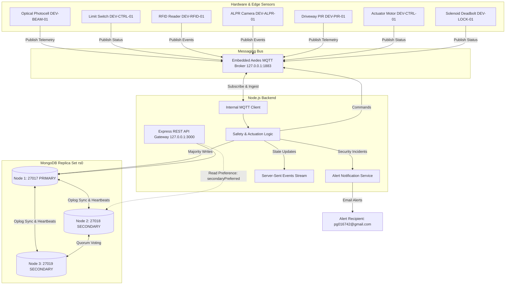
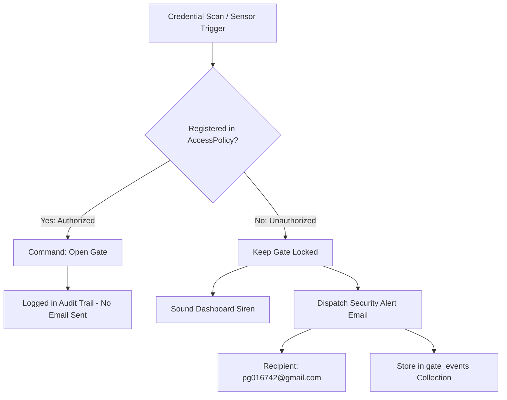

# IoThings Smart House Main Gate Automation System
### CMP6207 Modern Data Stores — Coursework Project & Technical Implementation

---

## Table of Contents

1. [Project Overview](#project-overview)
2. [Key Capabilities](#key-capabilities)
3. [System Architecture](#system-architecture)
4. [Getting Started (Quick Start)](#getting-started-quick-start)
5. [Demo & Verification Walkthrough](#demo--verification-walkthrough)
6. [Replica Set Management (`rs0`)](#replica-set-management-rs0)
7. [MQTT Messaging & Topic Taxonomy](#mqtt-messaging--topic-taxonomy)
8. [Sensors & Physical State Logic](#sensors--physical-state-logic)
9. [Telemetry Ingestion & 30-Day TTL Retention](#telemetry-ingestion--30-day-ttl-retention)
10. [Security Alerts & Notification Filtering](#security-alerts--notification-filtering)
11. [Testing & Verification](#testing--verification)
12. [Performance & Benchmark Results](#performance--benchmark-results)
13. [REST API Reference](#rest-api-reference)
14. [Repository Structure](#repository-structure)
15. [Troubleshooting & Gotchas](#troubleshooting--gotchas)
16. [Coursework Assessment Mapping](#coursework-assessment-mapping)

---

## Project Overview

This project implements a distributed access control and telemetry backend developed for **IoThings Home Automation Solutions** (a UK SME specializing in residential smart-home installations) for the Birmingham City University Level 6 module **CMP6207: Modern Data Stores**.

The system replaces traditional relational database bottlenecks by providing:
- A distributed **MongoDB 3-Node Replica Set (`rs0`)** handling continuous telemetry ingestion, majority-acknowledged audit trails, and automated leader failover.
- An embedded **Aedes MQTT broker** (`port 1883`) handling high-speed, lightweight publish-subscribe messaging between virtualized gate sensors, controllers, and backend services.
- An asynchronous **Node.js Express REST API** (`port 3000`) and a real-time web dashboard featuring Server-Sent Events (SSE), motor wattage dials, access policy management, and simulation controls.

---

## Key Capabilities

- **3-Node Distributed Replica Set (`rs0`):** Runs on ports `27017` (Primary), `27018` (Secondary), and `27019` (Secondary). Enforces quorum durability (`{ w: "majority", j: true }`) for security-critical events and automatic primary re-election upon node failure.
- **Physical Sensor Tracking:**
  - **Optical Safety Photocell:** Tracks optical signal strength (0–100%), beam continuity, and generates dirty-lens maintenance warnings.
  - **Mechanical Limit Switch (Dual-Boundary):** Confirms positive mechanical stops for `FULLY_CLOSED` (~2.1W standby), `FULLY_OPEN` (~2.3W standby), and `AJAR` during travel (~48W active draw).
  - **Contactless RFID Reader:** Tracks reader heartbeat pulses, antenna impedance tuning, and background RF noise levels (-85 to -80 dBm nominal).
- **Sub-Second Safety Auto-Reverse:** Immediately dispatches an MQTT reverse command if an obstacle interrupts the photocell beam while the gate is closing.
- **Continuous Telemetry Stream:** Emits sensor readings over MQTT on a 15-second cadence and records them to MongoDB with a 30-day TTL expiration index.
- **Smart Security Alerting:** Sends automated email alerts via Nodemailer exclusively for security events (unregistered RFID tags, unknown vehicle plates, perimeter PIR breaches, or housing tamper shocks). Routine authorized household access is logged quietly to prevent notification fatigue.
- **Operator Web Dashboard:** Browser interface providing real-time gate state animations, sensor health gauges, access policy management, and simulation triggers.
- **Automated Test Suite:** 18 integration tests covering API endpoints, data ingestion, CRUD operations, and alerting pipelines.

---

## System Architecture



---

## Getting Started (Quick Start)

### 1. Prerequisites
- **Node.js**: v18.0.0 or higher
- **MongoDB**: Community Edition (`mongod` and `mongosh` accessible in your PATH)

### 2. Configure Environment (`.env`)
The repository includes a ready-to-use [`.env`](file://.env) file:
```env
PORT=3000
MQTT_PORT=1883
MONGO_URI=mongodb://127.0.0.1:27017,127.0.0.1:27018,127.0.0.1:27019/iothings_gate?replicaSet=rs0&readPreference=primaryPreferred
DEFAULT_ALERT_EMAIL=pg016742@gmail.com
```
*Alert emails for unauthorized access attempts are sent to `pg016742@gmail.com`.*

### 3. Start the MongoDB 3-Node Replica Set
```bash
npm run cluster:start
```
*Launches 3 local background `mongod` nodes on ports `27017`, `27018`, and `27019` using Python double-fork (safe on macOS without `--fork` issues) and initiates replica set `rs0`.*

### 4. Verify Cluster Health & Replication
```bash
npm run cluster:check
```
*Inspects all 3 nodes, verifying identical record counts and zero replication lag.*

### 5. Seed Initial Dataset
```bash
npm run seed
```
Populates MongoDB with the initial project dataset:
- 1,800+ historical gate audit events
- 4,000+ time-series telemetry records (14-day sample)
- 7 gate hardware device definitions
- 6 access policies with schedules

### 6. Start the Application
```bash
npm start
```
Starts the Express server on `http://localhost:3000` and the embedded MQTT broker on port `1883`. The telemetry background emitter starts automatically.

To stop the server and free ports:
```bash
npm run server:stop
```

### 7. Run Integration Tests
```bash
npm test
```
Runs all 18 automated tests against the live API and replica set.

### 8. Run Performance Benchmarks
```bash
npm run benchmark
```
Executes CRUD measurements, write concern comparisons (`w: 1` vs `w: majority`), and aggregation queries, writing the output to [`report/benchmark_results.json`](file:///Users/pramod/Desktop/Modern_data_stores/report/benchmark_results.json).

### 9. Build Coursework Report PDF
```bash
npm run report:pdf
```
Renders the HTML coursework report into [`report/IoThings_Main_Gate_Automation_Report.pdf`](file:///Users/pramod/Desktop/Modern_data_stores/report/IoThings_Main_Gate_Automation_Report.pdf).

---

## Demo & Verification Walkthrough

Follow this step-by-step walkthrough to evaluate or demonstrate the system:

| Step | Action | Description | Expected Result |
| :--- | :--- | :--- | :--- |
| **1. Cluster Start** | `npm run cluster:start` | Launches 3 local `mongod` nodes and configures replica set `rs0`. | Nodes on 27017, 27018, and 27019 join replica set. |
| **2. Check Sync** | `npm run cluster:check` | Queries collection counts across all 3 nodes. | Identical counts on 27017, 27018, and 27019; lag: 0s. |
| **3. Seed Data** | `npm run seed` | Populates synthetic test data (devices, policies, events, telemetry). | Collections populated; terminal shows counts. |
| **4. Server Launch** | `npm start` | Boots Express REST API, static dashboard, and embedded Aedes MQTT broker. | Logs show connection to `rs0`, MQTT on 1883, HTTP on 3000. |
| **5. Web Dashboard** | Open `http://localhost:3000` | Open the browser interface to inspect live state and gauges. | Cluster, MQTT, and gate status cards show active states. |
| **6. Gate Operation** | Click **Open Gate** in UI | Issues command via REST API; internal broker publishes to MQTT topic. | Gate transitions through `OPENING` to `OPEN`. |
| **7. Safety Auto-Reverse** | Click **Simulate Beam Interruption** | Simulates obstacle during closing sequence. | Gate immediately halts and auto-reverses to `OPEN`. |
| **8. Security Alert** | `npm run sim:unauthorized` | Simulates unrecognized credential or perimeter breach. | Gate remains locked; security alert email is dispatched to `pg016742@gmail.com`. |
| **9. Policy Management** | Click **+ Add Credential** | Creates a new access policy in MongoDB via REST API. | Policy appears in table and can be verified immediately. |
| **10. Test Harness** | `npm test` | Runs the test suite across endpoints and logic. | All 18 tests pass with 100% success rate. |
| **11. Node Failover** | `kill $(lsof -ti:27017)` | Terminates current Primary node. | A Secondary node (27018 or 27019) is elected Primary in <3s. |

---

## Replica Set Management (`rs0`)

The cluster scripts are located in [`scripts/`](file:///Users/pramod/Desktop/Modern_data_stores/scripts/):

```bash
# Start cluster nodes (ports 27017, 27018, 27019) and initiate rs0:
npm run cluster:start

# Inspect collection counts and replication lag:
npm run cluster:check

# Stop all 3 cluster nodes:
npm run cluster:stop
```

### Inspecting Secondary Nodes in `mongosh`
When connecting directly to a secondary node (port `27018` or `27019`), MongoDB requires setting the read preference before running queries:
```javascript
// Connect to Node 2:
mongosh --port 27018

// Inside mongosh:
use iothings_gate
db.getMongo().setReadPref('secondary')
db.gate_devices.find()
db.gate_events.countDocuments()
```

---

## MQTT Messaging & Topic Taxonomy

The internal Aedes broker listens on port `1883`.

### Verification via CLI
```bash
# Using the built-in Node.js subscriber (streams all iothings/# telemetry, status, and event topics in real time):
npm run mqtt:sub

# Or with mosquitto_sub (if installed):
mosquitto_sub -h 127.0.0.1 -p 1883 -t "iothings/#" -v
```

### Topic Reference

| Topic | Publisher | QoS | Description |
| :--- | :--- | :---: | :--- |
| `iothings/home/{homeId}/gate/telemetry` | Sensors / Simulator | 0 | 15s periodic readings (photocell, limit switch, RFID metrics). |
| `iothings/home/{homeId}/gate/events` | Edge Devices | 1 | Credential scans, safety trips, and tamper detections. |
| `iothings/home/{homeId}/gate/status` | Controller / Simulator | 1 | Physical gate state (`LOCKED`, `IDLE_CLOSED`, `OPENING`, `OPEN`, `CLOSING`). |
| `iothings/home/{homeId}/gate/commands` | Backend / API | 1 | Operational commands (`OPEN`, `CLOSE`, `LOCK`, `UNLOCK`, `STOP`, `HOLD_OPEN`). |

---

## Sensors & Physical State Logic

The backend monitors three physical sensor subsystems:

| Sensor | Key Fields | Expected Range | Function |
| :--- | :--- | :--- | :--- |
| **Optical Safety Photocell** | `healthStatus`<br>`opticalSignalStrength`<br>`beamContinuity` | 85%–100% optical signal<br>`beamContinuity`: `true` | Prevents closing on vehicles or pedestrians. Triggers auto-reverse if beam breaks. Warnings when dirty (<65%). |
| **Mechanical Limit Switch** | `restingState`<br>`ambientMotorTemperatureC`<br>`standbyPowerWatts` | `FULLY_CLOSED` (~2.1W)<br>`FULLY_OPEN` (~2.3W)<br>`AJAR` (~48W active) | Verifies gate end-stop seating. Differentiates resting states from in-flight transit or stalled mid-travel. |
| **RFID Reader** | `operationalHeartbeat`<br>`antennaStatus`<br>`backgroundNoiseDbm` | Heartbeat: `true`<br>Noise: -85 to -80 dBm | Scans access credentials against policies. Flags RF interference if background noise exceeds -65 dBm. |

### Limit Switch Resting States: `FULLY_CLOSED`, `AJAR`, `FULLY_OPEN`

```text
[ FULLY_CLOSED ] ─────── (In Transit: AJAR) ───────► [ FULLY_OPEN ]
   (2.1W Standby)         (48.0W Active Draw)         (2.3W Standby)
Closed switch: CLOSED     Both switches: OPEN         Open switch: CLOSED
Open switch:   OPEN                                   Closed switch: OPEN
```

- **In-flight Travel:** During motor transit, neither switch is engaged (`AJAR`), and active motor draw is ~48W.
- **Mid-travel Obstacle Halt:** If movement stops before reaching an end-stop, the state remains `AJAR` with 0W active motor draw.
- **Incomplete Closure:** If wind resistance or debris prevents complete latching against the strike plate, `AJAR` highlights an unsecured boundary.

---

## Telemetry Ingestion & 30-Day TTL Retention

- **Sampling Cadence:** Telemetry is gathered on a 15-second interval (`TELEMETRY_INTERVAL_MS=15000`).
- **Data Locality:** Telemetry points embed all three sensor readings within a single BSON document, avoiding multi-table relational joins.
- **Automatic TTL Retention:** Historical records expire after 30 days via a MongoDB TTL index on the `timestamp` field (`expireAfterSeconds: 2592000`), maintaining compliance with UK GDPR data minimization requirements.

---

## Security Alerts & Notification Filtering

Email alerts are dispatched **exclusively for unauthorized access attempts and security events** to keep routine household entry quiet and prevent alert fatigue.



### Alert Triggers
- **Unregistered RFID badge:** Unknown tag presented at pillar reader (`RFID_ENTRY_DENIED`).
- **Unregistered license plate:** Unrecognized vehicle detected by ALPR camera (`ALPR_ENTRY_DENIED`).
- **Perimeter intrusion:** Driveway PIR motion while gate is locked (`INTRUSION_DETECTED`).
- **Enclosure tamper:** Accelerometer detects physical vibration/shock on controller housing (`TAMPER_ALARM`).

### Configuring Alert Delivery

#### 1. Setting the Recipient Address
In your [`.env`](file://.env) file, set the recipient who will receive the alerts:
```env
DEFAULT_ALERT_EMAIL=pg016742@gmail.com
```

#### 2. Choosing Delivery Transport

- **Mode A: Real Delivery to Gmail Inbox (Recommended for Live Alerts)**
  Google requires an **App Password** for automated scripts:
  1. Go to your **[Google Account](https://myaccount.google.com/)** &rarr; **Security**.
  2. Enable **2-Step Verification** (if not already enabled), then click **App passwords**.
  3. Create an app password for *"IoThings Gate"* (Google generates a 16-character code).
  4. In [`.env`](file://.env), configure your sender credentials:
     ```env
     DEFAULT_ALERT_EMAIL=pg016742@gmail.com
     SMTP_HOST=smtp.gmail.com
     SMTP_PORT=465
     SMTP_SECURE=true
     SMTP_USER=your_sender_account@gmail.com
     SMTP_PASS=abcd efgh ijkl mnop
     ```

- **Mode B: Zero-Config Test Mode (Default Ethereal Account)**
  If `SMTP_HOST` is left commented out in `.env`, the system automatically provisions an Ethereal test mailbox. When an alert fires, a secure clickable preview link is printed directly to the console:
  ```text
  [notifications] Security alert email dispatched to pg016742@gmail.com
  [notifications] Preview link: https://ethereal.email/message/...
  ```

### Verifying Email Delivery & Security Triggers

```bash
# 1. Test direct email transport and formatting (dispatches test alert to pg016742@gmail.com):
npm run test:email

# 2. Test full end-to-end intruder event (locks gate, logs to MongoDB with w:majority, sends email):
npm run sim:unauthorized

# 3. Test specific intrusion vectors:
# Unauthorized RFID tag presentation:
node scripts/simulate_unauthorized.js --type RFID --id UNKNOWN-CLONE-99

# Unregistered vehicle license plate detection:
node scripts/simulate_unauthorized.js --type ALPR --id UK-INTRUDER-99

# Physical controller housing tamper alarm:
node scripts/simulate_unauthorized.js --type TAMPER
```

---

## Testing & Verification

### Automated Test Suite
```bash
# Run all 18 automated integration tests:
npm test

# Test email dispatch directly to pg016742@gmail.com:
npm run test:email

# Test full intrusion simulation and alert dispatch:
npm run sim:unauthorized
```
The test harness runs 18 assertions covering:
- Health check and cluster topology endpoints
- Gate status queries and MQTT command publishing
- Sensor event and telemetry ingestion (both `FULLY_CLOSED` and `FULLY_OPEN` boundaries)
- Access policy lifecycle (Create, Read, Update, Verify, Delete)
- Analytics aggregation pipelines (hourly traffic, security incidents, motor health, sensor health)
- Alert dispatch to `pg016742@gmail.com` and email suppression for routine authorized entries

### Postman Collection
A collection of 36 pre-configured requests is available in [`postman/`](file:///Users/pramod/Desktop/Modern_data_stores/postman/). Refer to [`postman/POSTMAN_GUIDE.md`](file:///Users/pramod/Desktop/Modern_data_stores/postman/POSTMAN_GUIDE.md) for importing and executing the collection runner.

---

## Performance & Benchmark Results

Benchmarks run against the local 3-node replica set over 4,000+ historical telemetry documents:

### CRUD Latency
| Operation | Implementation | Average Latency |
| :--- | :--- | :--- |
| **Create** | `AccessPolicy.save()` | **~10–12 ms** |
| **Read** | `AccessPolicy.findOne()` | **~2–3 ms** |
| **Update** | `AccessPolicy.updateOne()` | **~8–10 ms** |
| **Delete** | `AccessPolicy.deleteOne()` | **~9–12 ms** |

### Write Concern Overhead
- `{ w: 1 }` (Primary-only acknowledgment): **~3.8 ms**
- `{ w: "majority", j: true }` (Replicated to quorum & journaled): **~8.9 ms**
- Quorum replication delta: **~5.1 ms**

### In-Database Aggregations
- Hourly traffic aggregation (24 buckets): **~5–7 ms**
- Security threat summary pipeline: **~2–3 ms**
- Motor health index calculation: **~4–5 ms**
- 3-core sensor diagnostics pipeline: **~10–14 ms**

To re-run benchmarks:
```bash
npm run benchmark
```

---

## REST API Reference

| Method | Path | Description |
| :--- | :--- | :--- |
| `GET` | `/health` | Server and database health status |
| `GET` | `/api/cluster/status` | MongoDB replica set status and topology |
| `GET` | `/api/gate/status` | Current gate position, deadbolt, and reed switch state |
| `POST` | `/api/gate/command` | Dispatch gate action (`OPEN`, `CLOSE`, `LOCK`, `UNLOCK`, `STOP`) |
| `GET` | `/api/sensors/events` | Query audit event log (filter by `homeId`, `severity`, date) |
| `POST` | `/api/sensors/event` | Ingest an event directly via HTTP |
| `GET` | `/api/sensors/telemetry` | Retrieve recent telemetry readings |
| `POST` | `/api/sensors/generate-telemetry` | Generate an on-demand telemetry sample |
| `POST` | `/api/sensors/unauthorized` | Ingest unauthorized intrusion event and dispatch alert email |
| `POST` | `/api/sensors/simulate` | Trigger simulation actions (`UNAUTHORIZED_PERSON`, `SAFETY_OBSTACLE`, etc.) |
| `GET` | `/api/policies` | List access control policies |
| `POST` | `/api/policies` | Register a new access policy |
| `GET` | `/api/policies/:id` | Fetch single policy by ID or identifier |
| `PUT` | `/api/policies/:id` | Update an existing policy |
| `DELETE` | `/api/policies/:id` | Remove an access policy |
| `POST` | `/api/policies/verify` | Verify credential authorization |
| `GET` | `/api/notifications` | View dispatched notification log |
| `POST` | `/api/notifications/test` | Test routine entry verification (confirms email is suppressed) |
| `POST` | `/api/notifications/test-unauthorized` | Trigger test security alert email |
| `GET` | `/api/analytics/hourly-traffic` | 24-hour entry traffic aggregation |
| `GET` | `/api/analytics/security` | Security incident breakdown |
| `GET` | `/api/analytics/motor-health` | Actuator motor duty cycles and health score |
| `GET` | `/api/analytics/sensor-health` | 3-core sensor diagnostics summary |

---

## Repository Structure

```text
Modern_data_stores/
├── .env                                # Environment configurations
├── package.json                        # Scripts, dependencies, and entrypoint
├── README.md                           # Project technical documentation
├── backend/
│   ├── server.js                       # Express app, Aedes MQTT broker, HTTP logger
│   ├── config/
│   │   └── database.js                 # Mongoose connection and cluster status helper
│   ├── models/
│   │   ├── AccessPolicy.js             # Schema for access credentials & schedules
│   │   ├── GateDevice.js               # Schema for registered gate hardware devices
│   │   ├── GateEvent.js                # Schema for gate audits, scans, and alarms
│   │   └── GateTelemetry.js            # Time-series telemetry schema with 30-day TTL
│   ├── mqtt/
│   │   ├── mqttBroker.js               # Embedded Aedes MQTT broker
│   │   └── mqttHandler.js              # MQTT subscriber, command router, and safety logic
│   ├── routes/
│   │   ├── analyticsRoutes.js          # Aggregation endpoints
│   │   ├── clusterRoutes.js            # Replica set diagnostic route
│   │   ├── gateRoutes.js               # Gate state and actuation routes
│   │   ├── notificationRoutes.js       # Notification audit and test routes
│   │   ├── policyRoutes.js             # Policy management endpoints
│   │   └── sensorRoutes.js             # Telemetry queries and simulation routes
│   └── services/
│       ├── analyticsService.js         # MongoDB aggregation queries
│       ├── emailService.js             # Alert email dispatcher (Gmail / Ethereal)
│       └── telemetryEmitter.js         # Telemetry generator and intrusion emitter
├── public/
│   ├── index.html                      # Web dashboard interface
│   ├── css/
│   │   └── style.css                   # Dashboard styles
│   └── js/
│       └── app.js                      # Client dashboard logic (SSE listener, charts, controls)
├── scripts/
│   ├── start_replica_set.sh            # Script to start 3 local mongod daemons and initiate rs0
│   ├── stop_replica_set.sh             # Script to stop the local replica set
│   ├── check_replication.sh            # Script to check counts & lag across 27017, 27018, 27019
│   ├── seed_dataset.js                 # Dataset seeder (events, telemetry, devices, policies)
│   ├── continuous_sensor_generator.js  # Dedicated 15s telemetry stream generator
│   ├── simulate_unauthorized.js        # Intrusion simulation script
│   ├── mqtt_subscriber.js              # CLI MQTT subscriber for debugging
│   ├── benchmark_queries.js            # Latency benchmark runner
│   └── test_email.js                   # Direct SMTP email tester
├── simulator/
│   └── gate_simulator.js               # Hardware simulator for scans, obstacles, and motion
├── tests/
│   └── api.test.js                     # 18 automated integration tests
├── postman/
│   ├── IoThings_Smart_Gate.postman_collection.json # 36 pre-configured requests
│   ├── IoThings_Local.postman_environment.json     # Environment variables
│   └── POSTMAN_GUIDE.md                            # Postman collection runner documentation
└── report/
    ├── IoThings_Main_Gate_Automation_Report.pdf    # Coursework consultancy report
    ├── IoThings_Main_Gate_Automation_Report.html   # HTML report source
    ├── IoThings_Main_Gate_Automation_Report.md     # Markdown report source
    ├── IoThings_Main_Gate_Automation_Report.tex    # LaTeX report source
    ├── benchmark_results.json                      # Output from benchmark runner
    └── figures/                                    # Architectural diagrams (.drawio)
```

---

## Troubleshooting & Gotchas

### `Error: listen EADDRINUSE: address already in use :::3000`
A previous process is holding port 3000 or 1883. Run:
```bash
npm run server:stop
```

### `MongooseServerSelectionError: connect ECONNREFUSED 127.0.0.1:27017`
The MongoDB cluster is not running. Start it with:
```bash
npm run cluster:start
```

### `BadValue: Server fork+exec via --fork ... is incompatible with macOS`
On macOS Darwin, modern MongoDB versions disable the `--fork` CLI flag due to OS multithreading constraints. Use the project startup script which handles daemonization cleanly:
```bash
npm run cluster:start
```

### `MongoServerError: This node was not started with replication enabled`
A standalone MongoDB service (such as Homebrew's `mongodb-community`) is holding port 27017. Stop the standalone service and start the replica set:
```bash
brew services stop mongodb-community
npm run cluster:start
```

### Secondary Queries Returning `null` or Erroring
On secondary nodes (ports `27018` or `27019`), switch to the application database and enable secondary reads:
```javascript
use iothings_gate
db.getMongo().setReadPref('secondary')
db.gate_devices.find()
```

---

## Coursework Assessment Mapping

Mapping of coursework requirements to project implementation:

| Module Requirement | Implementation Detail | Location in Repository |
| :--- | :--- | :--- |
| **NoSQL Paradigm Evaluation** | Comparative analysis of Document, Key-Value, Columnar, and Graph models under the CAP and PACELC theorems. | [Report PDF](file:///Users/pramod/Desktop/Modern_data_stores/report/IoThings_Main_Gate_Automation_Report.pdf) Sections 2 & 4 |
| **Relational vs. NoSQL Comparison** | Evaluation of schema-on-write vs schema-on-read, normalization vs document embedding, and polyglot persistence. | [Report PDF](file:///Users/pramod/Desktop/Modern_data_stores/report/IoThings_Main_Gate_Automation_Report.pdf) Sections 3 & 5 |
| **Distributed Data Management** | 3-node MongoDB Replica Set (`rs0`) with quorum voting, Raft election failover, and majority write concern. | [`scripts/start_replica_set.sh`](file:///Users/pramod/Desktop/Modern_data_stores/scripts/start_replica_set.sh), [backend/config/database.js](file:///Users/pramod/Desktop/Modern_data_stores/backend/config/database.js) |
| **SME Smart Gate Scenario** | Data store for residential gate automation: Photocell, Limit Switch, and RFID monitoring with a 30-day TTL index. | [backend/models/GateTelemetry.js](file:///Users/pramod/Desktop/Modern_data_stores/backend/models/GateTelemetry.js), [backend/services/telemetryEmitter.js](file:///Users/pramod/Desktop/Modern_data_stores/backend/services/telemetryEmitter.js) |
| **Node.js & MQTT Integration** | Express API (`:3000`) integrated with embedded Aedes broker (`:1883`) for sensor telemetry and auto-reverse safety. | [backend/mqtt/mqttHandler.js](file:///Users/pramod/Desktop/Modern_data_stores/backend/mqtt/mqttHandler.js), [backend/server.js](file:///Users/pramod/Desktop/Modern_data_stores/backend/server.js) |
| **Access Policy Management** | Create, Read, Update, and Delete endpoints on credential policies, verified with automated tests. | [backend/routes/policyRoutes.js](file:///Users/pramod/Desktop/Modern_data_stores/backend/routes/policyRoutes.js), [tests/api.test.js](file:///Users/pramod/Desktop/Modern_data_stores/tests/api.test.js) |
| **Synthetic Dataset** | Synthetic dataset of audit events, time-series telemetry samples, registered hardware devices, and policies. | [scripts/seed_dataset.js](file:///Users/pramod/Desktop/Modern_data_stores/scripts/seed_dataset.js) |
